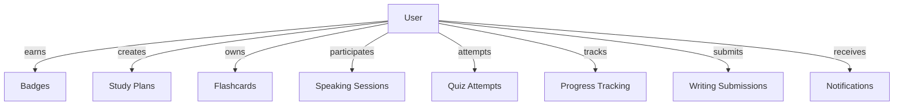
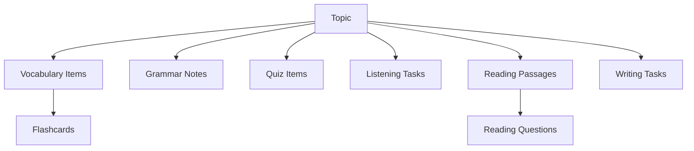
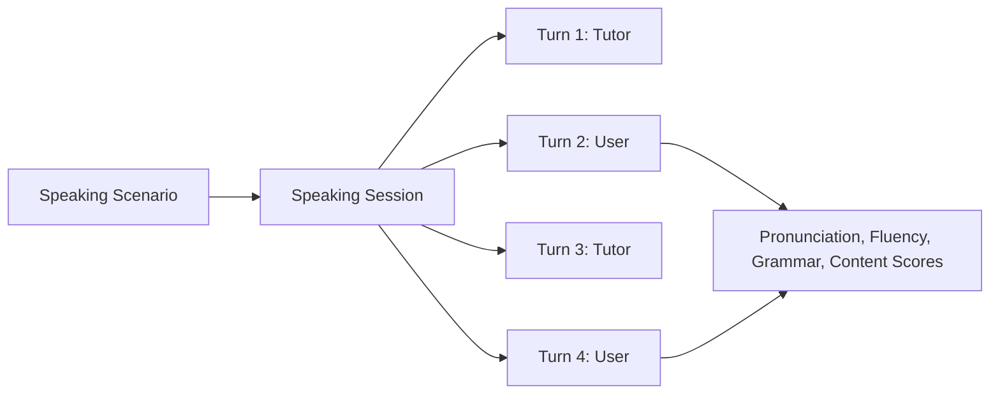
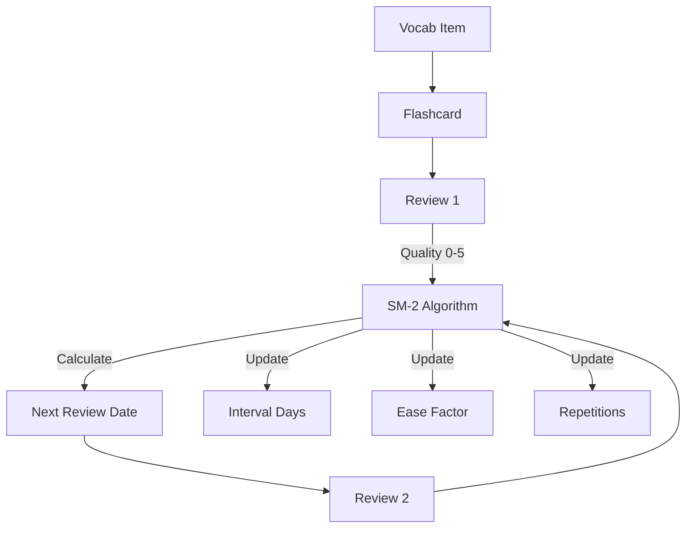

# 🗄️ Database ERD - EnglishFlow

## 📊 Entity Relationship Diagram

### Full Schema Overview

```mermaid
erDiagram
    %% ============================================
    %% USERS & AUTHENTICATION
    %% ============================================
    
    User ||--o{ UserBadge : "earns"
    User ||--o{ Notification : "receives"
    User ||--o{ StudyPlan : "creates"
    User ||--o{ Flashcard : "owns"
    User ||--o{ SpeakingSession : "participates"
    User ||--o{ QuizAttempt : "attempts"
    User ||--o{ UserTopicProgress : "tracks"
    User ||--o{ UserVocabProgress : "tracks"
    User ||--o{ WritingSubmission : "submits"
    
    Badge ||--o{ UserBadge : "awarded"
    
    User {
        string id PK
        string email UK
        string name
        string password
        string avatar
        string firstName
        string lastName
        string gender
        string phone
        datetime dateOfBirth
        string country
        string job
        string company
        string facebookLink
        string linkedinLink
        enum currentLevel
        enum learningGoal
        int minutesPerDay
        int wordsPerDay
        int xp
        int streak
        datetime lastStudyDate
        int totalLearningMinutes
        datetime createdAt
        datetime updatedAt
    }
    
    Badge {
        string id PK
        string name
        string description
        string icon
        enum category
        string requirement
        datetime createdAt
    }
    
    UserBadge {
        string id PK
        string userId FK
        string badgeId FK
        datetime earnedAt
    }
    
    Notification {
        string id PK
        string userId FK
        string heading
        string content
        boolean isRead
        datetime createdAt
    }
    
    %% ============================================
    %% TOPICS & VOCABULARY
    %% ============================================
    
    Topic ||--o{ VocabItem : "contains"
    Topic ||--o{ GrammarNote : "has"
    Topic ||--o{ QuizItem : "includes"
    Topic ||--o{ ListeningTask : "provides"
    Topic ||--o{ ReadingPassage : "offers"
    Topic ||--o{ WritingTask : "assigns"
    Topic ||--o{ UserTopicProgress : "tracked_by"
    
    VocabItem ||--o{ Flashcard : "becomes"
    VocabItem ||--o{ UserVocabProgress : "tracked_by"
    
    Topic {
        string id PK
        string title
        string description
        enum level
        string category
        string subcategory
        string thumbnail
        int wordCount
        int estimatedTime
        boolean isActive
        datetime createdAt
        datetime updatedAt
    }
    
    VocabItem {
        string id PK
        string topicId FK
        string word
        string pronunciation
        enum partOfSpeech
        string meanings
        string vietnameseMeanings
        string examples
        string collocations
        string synonyms
        string antonyms
        string relatedWords
        string audioUrl
        datetime createdAt
        datetime updatedAt
    }
    
    UserVocabProgress {
        string id PK
        string userId FK
        string vocabItemId FK
        enum masteryLevel
        int timesReviewed
        datetime lastReviewedAt
        datetime createdAt
        datetime updatedAt
    }
    
    UserTopicProgress {
        string id PK
        string userId FK
        string topicId FK
        int progress
        string completedSections
        datetime startedAt
        datetime completedAt
        datetime updatedAt
    }
    
    %% ============================================
    %% GRAMMAR
    %% ============================================
    
    GrammarNote {
        string id PK
        string topicId FK
        string title
        text explanation
        string examples
        datetime createdAt
        datetime updatedAt
    }
    
    %% ============================================
    %% QUIZ & ASSESSMENT
    %% ============================================
    
    QuizItem ||--o{ QuizAttempt : "attempted_in"
    
    QuizItem {
        string id PK
        string topicId FK
        string question
        enum type
        string options
        string correctAnswer
        string explanation
        datetime createdAt
        datetime updatedAt
    }
    
    QuizAttempt {
        string id PK
        string userId FK
        string quizItemId FK
        string userAnswer
        boolean isCorrect
        int timeSpent
        datetime createdAt
    }
    
    %% ============================================
    %% LISTENING
    %% ============================================
    
    ListeningTask {
        string id PK
        string topicId FK
        enum type
        string question
        string audioUrl
        text transcript
        string options
        string correctAnswer
        datetime createdAt
        datetime updatedAt
    }
    
    %% ============================================
    %% READING
    %% ============================================
    
    ReadingPassage ||--o{ ReadingQuestion : "contains"
    
    ReadingPassage {
        string id PK
        string topicId FK
        string title
        text content
        string glossary
        datetime createdAt
        datetime updatedAt
    }
    
    ReadingQuestion {
        string id PK
        string passageId FK
        string question
        enum type
        string options
        string correctAnswer
        string explanation
        datetime createdAt
    }
    
    %% ============================================
    %% WRITING
    %% ============================================
    
    WritingTask ||--o{ WritingSubmission : "receives"
    
    WritingTask {
        string id PK
        string topicId FK
        string title
        text prompt
        string requiredWords
        string suggestions
        int minWords
        int maxWords
        datetime createdAt
        datetime updatedAt
    }
    
    WritingSubmission {
        string id PK
        string userId FK
        string taskId FK
        text content
        int wordCount
        text feedback
        int score
        int grammarScore
        int vocabularyScore
        int coherenceScore
        datetime createdAt
        datetime updatedAt
    }
    
    %% ============================================
    %% SPEAKING
    %% ============================================
    
    SpeakingScenario ||--o{ SpeakingSession : "used_in"
    
    SpeakingSession ||--o{ SpeakingTurn : "contains"
    
    SpeakingScenario {
        string id PK
        string title
        string description
        string category
        string subcategory
        enum level
        string goal
        text context
        string thumbnail
        string objectives
        string keyExpressions
        int totalSessions
        int estimatedMinutes
        boolean isCustom
        boolean isActive
        datetime createdAt
        datetime updatedAt
    }
    
    SpeakingSession {
        string id PK
        string userId FK
        string scenarioId FK
        enum status
        int overallScore
        float pronunciationScore
        float fluencyScore
        float grammarScore
        float contentScore
        datetime startedAt
        datetime completedAt
    }
    
    SpeakingTurn {
        string id PK
        string sessionId FK
        enum role
        text text
        string audioUrl
        float pronunciationScore
        float fluencyScore
        float grammarScore
        float contentScore
        datetime createdAt
    }
    
    %% ============================================
    %% FLASHCARDS & SRS
    %% ============================================
    
    FlashcardCollection ||--o{ Flashcard : "organizes"
    
    Flashcard ||--o{ FlashcardReview : "reviewed_in"
    
    Flashcard {
        string id PK
        string userId FK
        string vocabItemId FK
        text front
        text back
        int interval
        float easeFactor
        int repetitions
        datetime nextReviewDate
        datetime lastReviewDate
        string collectionId FK
        string tags
        datetime createdAt
        datetime updatedAt
    }
    
    FlashcardCollection {
        string id PK
        string name
        string icon
        enum type
        datetime createdAt
    }
    
    FlashcardReview {
        string id PK
        string flashcardId FK
        int quality
        int timeSpent
        datetime createdAt
    }
    
    %% ============================================
    %% STUDY PLANS
    %% ============================================
    
    StudyPlan ||--o{ StudyUnit : "includes"
    StudyPlan ||--o{ DailyTask : "assigns"
    StudyPlan ||--o{ TimeBlock : "schedules"
    
    StudyPlan {
        string id PK
        string userId FK
        string name
        string goal
        enum level
        int totalHours
        float studiedHours
        int minutesPerDay
        datetime startDate
        datetime endDate
        enum status
        float progress
        datetime createdAt
        datetime updatedAt
    }
    
    StudyUnit {
        string id PK
        string planId FK
        string title
        enum type
        string topicId
        boolean completed
        int estimatedMinutes
        int order
        datetime createdAt
        datetime completedAt
    }
    
    DailyTask {
        string id PK
        string planId FK
        enum type
        string title
        string link
        boolean completed
        datetime dueDate
        datetime createdAt
        datetime completedAt
    }
    
    TimeBlock {
        string id PK
        string planId FK
        enum dayOfWeek
        string startTime
        string endTime
        datetime createdAt
    }
```



---

## 📊 Schema Statistics

### Tables by Category

| Category | Tables | Description |
|----------|--------|-------------|
| **Users & Auth** | 4 | User management, badges, notifications |
| **Topics & Vocabulary** | 4 | Learning content, vocabulary, progress |
| **Grammar** | 1 | Grammar notes and explanations |
| **Quiz** | 2 | Quizzes and user attempts |
| **Listening** | 1 | Listening exercises |
| **Reading** | 2 | Reading passages and questions |
| **Writing** | 2 | Writing tasks and submissions |
| **Speaking** | 3 | Speaking scenarios, sessions, turns |
| **Flashcards** | 3 | Flashcards, collections, reviews (SRS) |
| **Study Plans** | 4 | Study plans, units, tasks, schedules |
| **TOTAL** | **25** | |

---

## 🔗 Key Relationships

### User-Centric Relationships



### Content Hierarchy



### Speaking Flow



### SRS (Spaced Repetition System)



---

## 📋 Enums Reference

### CEFRLevel
```
A1, A2, B1, B2, C1, C2
```

### LearningGoal
```
CONVERSATION, TRAVEL, WORK, EXAM, CASUAL, INTERMEDIATE, FLUENT
```

### PartOfSpeech
```
NOUN, VERB, ADJECTIVE, ADVERB, PREPOSITION, CONJUNCTION, PRONOUN, INTERJECTION
```

### MasteryLevel
```
BRAND_NEW, NOT_REMEMBERED, NORMAL, REMEMBERED, MASTERED
```

### QuizType
```
MULTIPLE_CHOICE, FILL_BLANK, MATCHING, TRUE_FALSE, SHORT_ANSWER
```

### ListeningType
```
DICTATION, MCQ, FILL_BLANK
```

### BadgeCategory
```
STREAK, XP, VOCABULARY, SPEAKING, QUIZ, ACHIEVEMENT
```

### SessionStatus
```
IN_PROGRESS, COMPLETED, ABANDONED
```

### SpeakerRole
```
USER, TUTOR, AI
```

### CollectionType
```
VOCABULARY, GRAMMAR, COLLOCATIONS, IDIOMS, PHRASAL_VERBS, 
SENTENCE_PATTERNS, LINKING_WORDS, PRONUNCIATION, COMMON_MISTAKES, CUSTOM
```

### StudyType
```
VOCAB, GRAMMAR, LISTENING, READING, SPEAKING, WRITING, QUIZ
```

### PlanStatus
```
ACTIVE, COMPLETED, PAUSED, ARCHIVED
```

### DayOfWeek
```
MONDAY, TUESDAY, WEDNESDAY, THURSDAY, FRIDAY, SATURDAY, SUNDAY
```

---

## 🎯 Design Principles

### 1. Normalization
- ✅ 3NF (Third Normal Form)
- ✅ No redundant data
- ✅ Proper foreign keys

### 2. Scalability
- ✅ Indexed columns for fast queries
- ✅ JSON fields for flexible data
- ✅ Cascade deletes for data integrity

### 3. Type Safety
- ✅ Enums for fixed values
- ✅ Proper data types
- ✅ Non-null constraints where needed

### 4. Performance
- ✅ Indexes on foreign keys
- ✅ Indexes on frequently queried columns
- ✅ Composite indexes where needed

### 5. Flexibility
- ✅ JSON fields for arrays/objects
- ✅ Nullable fields for optional data
- ✅ Extensible design

---

## 📈 Growth Potential

### Easy to Add:
- ✅ New topics and content
- ✅ New speaking scenarios
- ✅ New badges and achievements
- ✅ New quiz types
- ✅ New flashcard collections

### Scalable:
- ✅ Millions of users
- ✅ Thousands of topics
- ✅ Unlimited sessions/turns
- ✅ Large vocabulary database

### Extensible:
- ✅ Add new features without breaking existing
- ✅ Add new fields easily
- ✅ Add new relationships
- ✅ Add new enums

---

**📊 Total: 25 Tables | 13 Enums | 35+ Relations | Production-Ready**
